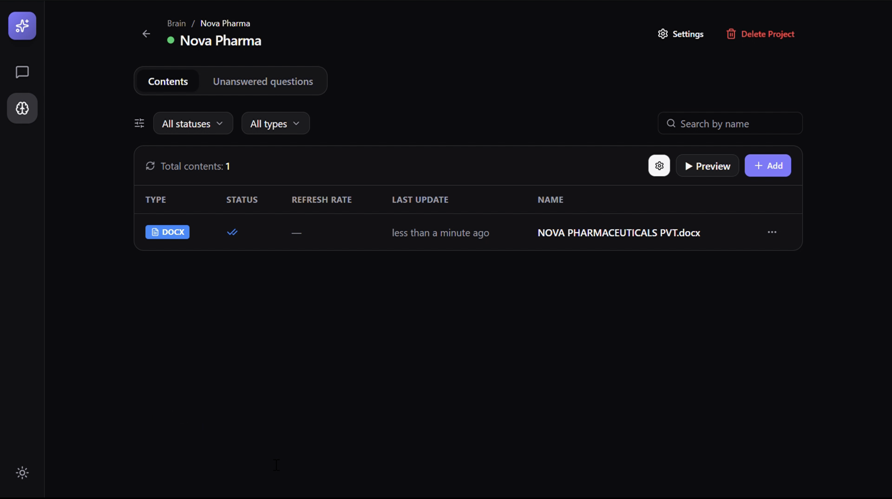
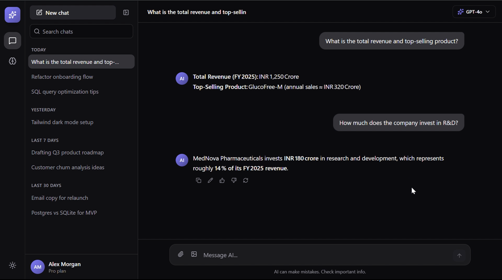

# RAG Web App

This is a simple Retrieval Augmented Generation (RAG) service demo that allows users to upload documents, chunk and convert them into vector embeddings, and perform semantic retrieval to answer queries using an LLM. Built as a standalone reference to showcase the core retrieval architecture of a larger document pipeline in a clean, public setup.

## Uploading Document

<div align="center">
  
</div>

## Chat Preview

<div align="center">
  
</div>

## Tech Stack

- Python
- FastAPI
- Uvicorn
- LangChain
- Qdrant
- MongoDB
- Ollama
- OpenRouter API
- HTML, CSS, JavaScript

## How It Works

- **Document ingestion**: Uploaded PDF and text files are processed via LangChain loaders (`PyPDFLoader` and `TextLoader`), split into chunks using `RecursiveCharacterTextSplitter`, and converted to vector embeddings locally with Ollama (`nomic-embed-text:v1.5`). The vectors are stored in Qdrant, and document metadata is saved in MongoDB.
- **Retrieval and QA**: When a user submits a question, the query is embedded with Ollama, relevant text chunks are retrieved from Qdrant via cosine similarity search, and an LLM (accessed through OpenRouter via the OpenAI client) generates an answer grounded in that context.
- **Frontend and management**: A lightweight HTML, CSS, and JavaScript interface served by FastAPI provides a question-and-answer view, a file upload and deletion manager, and an admin dashboard to view vector records or reset stored data.

## Steps for setup

### Prerequisites

Ensure the following local services are running:

- **Ollama** with the embedding model:
  ```bash
  ollama pull nomic-embed-text:v1.5
  ```
- **Qdrant** on port 6333:
  ```bash
  docker run -p 6333:6333 qdrant/qdrant
  ```
- **MongoDB** running on `localhost:27017`
- An **OpenRouter** API key

### Setup

1. Clone the repository:

```bash
git clone https://github.com/arsalan-99/RAG_project.git
cd RAG_project
```

2. Create a virtual environment and install dependencies:

```bash
python -m venv .venv
source .venv/bin/activate
pip install -r requirements.txt
```

3. Configure environment variables:

```bash
cp .env.example .env
```

Open `.env` and set your `LLM_API_KEY`.

4. Start the server:

```bash
cd backend
uvicorn server:app --reload
```

5. Open `http://localhost:8000` in your browser.
